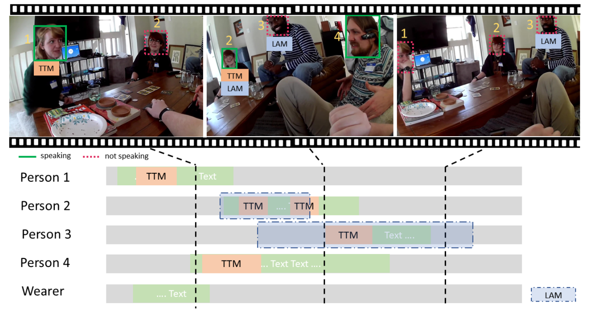

# DLCV Final Project ( Talking to me )
This project is about how to identify whether and when each visible face in a video is talking to the camera wearer, proposed in the [Ego4D Challenge](https://ego4d-data.org/docs/). Based on the video, audio, face bounding box, and the target time period, we need to output a binary prediction, representing whether the person is talking to me. Considering the multimodality of the data, we conduct various experiments to verify the effectiveness of fusing video and audio features at different stage. We select av-hubert, a self-supervised representation learning framework, as our final model and achieve accuracy 0.70491 (4th out of 14 teams) on the kaggle leaderboard. For more details about the challenge and the architecture we've tried, please refer to the [slides](https://docs.google.com/presentation/d/1Y-gwBmucYgbWLLk-u6coHi7LybFLXgA9gV8KiOiKShI/edit?usp=sharing) and our [poster](./poster.pdf).

</img>

# Preprocess for inference

To reproduce our preprocessing pipeline for inference, run:

```bash
$pip install -r requirements.txt
$bash preprocess_only_test.sh <Path to videos folder> <Path to test seg folder> <Path to test bbox folder> <Output directory>
```

This will create 2 directories under \<Output directory>:

1. **dlcvchallenge1_audios** (the extracted .wav from videos)
2. **dlcvchallenge1_test_data** (npz files of all testing data, named as hashcode_id_start_end.npz)

* each .npz contains files: ['image', 'audio', 'ttm', 'is_empty']
* preprocessing may take hours or days to finish


Example for the tree structure of output directory :

```
output_dir
├── dlcvchallenge1_audios
└── dlcvchallenge1_test_data
```

# Preprocess for train and inference
To reproduce our preprocessing pipeline for all data, run:
```bash
$pip install -r requirements.txt
$bash preprocess.sh <Path to videos folder> <Path to train seg folder> <Path to train bbox folder> <Path to test seg folder> <Path to test bbox folder> <Output directory>
```
This will create 3 directories under \<Output directory>:
1. **dlcvchallenge1_audios** (the extracted .wav from videos)
2. **dlcvchallenge1_train_data** (npz files of all training data)
3. **dlcvchallenge1_test_data** (npz files of all testing data, named as hashcode_id_start_end.npz)

* each .npz contains files: ['image', 'audio', 'ttm', 'is_empty']
* preprocessing may take hours or days to finish

Example for the tree structure of output directory :

```
output_dir
├── dlcvchallenge1_audios
├── dlcvchallenge1_train_data
└── dlcvchallenge1_test_data
```

# How to run your code?

* change directory to `av_hubert`
* Follow the instructions in README in `av_hubert`
* Notice : Our best submission on kaggle leaderboard is achieved by ensemble many checkpoint. However, we only provide one checkpoint owing to cloud storage's space limit. Therefore, the reproduced performance may drop a little bit compared to that on leaderboard.